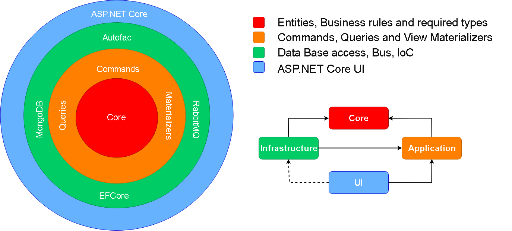
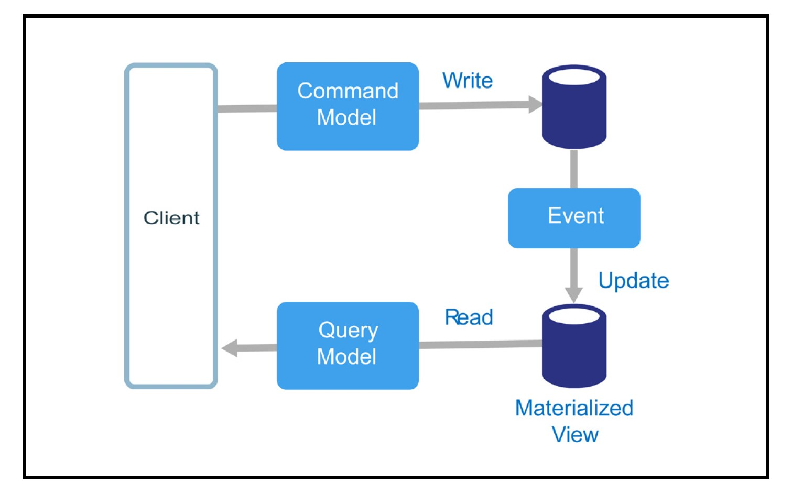

#  Clean Arquiteture CQRS with Derived Data  

CQRS, using Clean Architecture, multiple databases and Eventual Consistency

## :floppy_disk: How do I use it?

You need some the fallowing tools:

* Docker
* Visual Studio 2017
* .Net Core 2.1

## :dart: Clean Architecture

Here's the basic architecture of this microservice template:

* Respecting policy rules, with dependencies always pointing inward
* Separation of techology details from the rest of the system
* SOLID
* Single responsibility of each layer

## :scissors: CQRS

Segregation between Commands and Queries, with isolated databases and different models

### :arrow_down: Command Stack

Has direct access to business rules and is responsible for only writes in the application.

Below you can find a basic interaction between components in the **Command Stack**:

### :arrow_up: Query Stack

Responsible to provide data to consumers of your application, containing a simplified and more suitable model for reading, with calculated data, aggregated values and materialized structures.

The fallowing image contains the basic interaction beween components in the **Query Stack**:

## :books: DDD

This exemple contains a simplified Domain Model, with entities, aggregate roots, value objects and events, which are essential to syncronize the writing with reading database.

## :heavy_check_mark: TDD

The project contains a well defined IoC structure that allow you unit test almost every part of this service templates, besides technology dependencies.

Inside the main layers you gonna find Interfaces which are essential for the application, but com their implementations inside their own layers, what allow Mocking, Stubbing, using test doubles.

## :bar_chart: Data Intensive Microservice

This microservice template comes with a SRP and SOC in mind. Given the own nature of CQRS, you can easily scale this application tunning each stack separetly.

## :page_facing_up: Derived Data

Having multiple stores of data makes this system a Derived Data system, which means, you never lose data, you can always rebuild one store from another, for exemple, if you lose a event which sync data between the write and read database you can always get this data back from the write database and rebuild the read store.

## :envelope: Message Broker

Given the fisical isolation of data stores, **Command Stack** and **Query Stack** must communicate to syncronize data. This is done here using a Message Broker.

Every succeful handled command creates and event, which is published into a Message Broker. An syncronization backgroud process subscribe to those events and is responsible for updating the reading database.

## :clock2: Eventual Consistency

Everything comes with some kind of down side. The case of CRQS with multiple databases, to maintaing hight availability and scalability we create inconsistencys between databases.

More specificaly, replicating data between two databases creates an eventual consistency, which in a specific moment in time, given the replication lag they are different, although is a temporaty state and it eventualy resolves it self.

## :clipboard: References

Here's a list of reliable information used to bring this project to life.

* <a href="https://www.amazon.com/Designing-Data-Intensive-Applications-Reliable-Maintainable/dp/1449373321/ref=sr_1_1?ie=UTF8&qid=1537824366&sr=8-1&keywords=designing+data-intensive+applications" target="_blank">Designing Data Intensive Applications</a>

* <a href="https://www.amazon.com/Clean-Architecture-Craftsmans-Software-Structure/dp/0134494164" target="_blank">Clean Architecture, Robert C. Martin</a>

* <a href="https://azure.microsoft.com/en-us/campaigns/cloud-application-architecture-guide/" target="_blank">Cloud Application Architecture Guide</a>

* <a href="https://www.microsoftpressstore.com/store/microsoft-.net-architecting-applications-for-the-enterprise-9780735685352" target="_blank">Microsoft .NET - Architecting Applications for the Enterprise, 2nd Edition</a>
