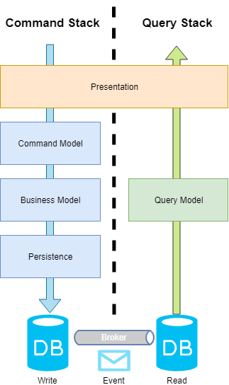
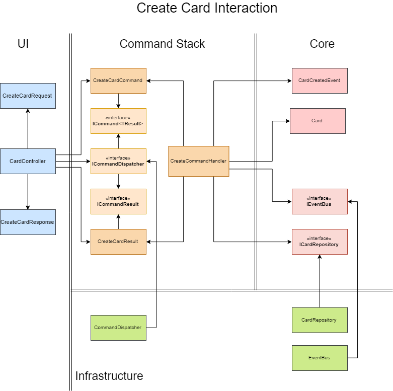

#  Clean Arquiteture CQRS with Derived Data  

CQRS, using Clean Architecture, multiple databases and Eventual Consistency

## :floppy_disk: How do I use it?

Coming soon.

## :dart: Clean Architecture

>The strategy behind that facilitation is to leave as many options open as possible, for as long as possible, Robbin C. Martin

Clean Architecture has lots of different interpretations and implementations around. I've tried to implement CQRS with Clean in the best way to take advantage of the main concepts of this architectural pattern, making this microservice template flexible, maintainable, evolvable, testable, detached from technology and what I think as more important respecting the policy rule below:

>Source Code dependencies must point only inward, towards higher-level policy.

This implementation brings as inner ring what I call **Core**, where you should implement your business rules, and keep the base of you microservice itself, such as: important interfaces, business entities, base classes, events. You're going to find that I'm using DDD here, with entities, aggregates, value objects and repository pattern. I've seem some implementations calling it Domain, but we shouldn't restrict this as a pattern or principles names, because what we can have there is more than what the DDD pattern does, is the heart of the application itself. Also, even if CQRS and DDD are likely to be used together, you can implement your business the way you want and take advantage of what is more important in this sample, data intensive applications.

The next ring, which many implementations call it **Application** contains our Use Cases. CQRS has an strict way to implement these Use Cases, we have an stack responsible for dealing directly with your Business Entities, adding, updating or removing, residing inside **Command**. Those Use Cases that require reading data are inside **Query**, and also the ways to transform business entities to Derived Data format, which is more suitable for reading. Consider both layers **Application**, they are at the same level, but in different assemblies with different responsibilities. 

The **Infrastructure** is responsible strictly to keep technology. You can find there the implementations of repositories for business entities, message brokers, dependency injection and any other thing that represents a detail for Clean Architecture, mostly framework dependent, external dependencies, etc.

The outer ring contains a way for users to communicate with our application, the **UI**. This layer can be anything that allow input or retrieve data. For this implementation I'm using ASP.NET as UI.

## :scissors: CQRS

In most scenarios business domains are complex, and they grow even more in complexity over time. Implementing simple queries using the same model became harder and using the same entities to perform them not suitable. 

To address this problem a good alternative is CQRS pattern. CRQS is an acronym for Command and Query Responsibility Segregation. As mentioned we have a well defined segregation between the model you write from the one you read.

This pattern is an excellent choice to maintain the scalability of your system, given the single responsibility of each stack, you can perform tuning to the stack in which more commonly operations are performed. 

For example, if you have a heavy load in the query stack you should implement cache strategies and database replication to balance and drastically improve readings. In other hand, if you have a heavy write load in your system, you could simply turn the command stack from a sync model to a async model to improve it.

> Separating queries from commands gives you the chance to work on the scalability aspects of both
> parts in total isolation, Dino Esposito, Architecting for the Enterprise 2nd edition

This miroservice template contains an implementations of CQRS with different databases, which makes even more clear the separation between commands and queries.

Although, CQRS bring complexity to your system, given that you must support messaging brokers and events to guarantee the synchronization between the write database and the read database.

### :arrow_down: Command Stack

Commands are responsible for performing writes in your system and should be task based.  

Each command has it own handler, in which the Use Case is implemented. Every time a command is dispatched and processed if the outcome is successful, an event is publish into a message broker with all needed information from your business entity, thereby your query stack can acknowledge changes in the write model, and persist it into the read database.

The example above you can see a CreateCardCommand, which is handled by the CreateCardCommandHandler. The handler acts as the Use Case implementaion, making the interactions between the command and Card domain entity. The Card is created given the command coming from the command and persisted using the CardWriteOnlyRepository. An CardCreatedEvent is then published to the event bus and an CreateCardCommandResult is returned to the caller.

Every command has a result pair in this implementations, because its not using an async model for the command stack. If you go for an async model, you could publish the result or even another event to a message queue to inform other clients.

### :arrow_up: Query Stack

Coming soon.

## :books: DDD

Coming soon.

## :heavy_check_mark: TDD

Coming soon.

## :bar_chart: Data Intensive Microservice

Coming soon.

## :page_facing_up: Derived Data

Coming soon.

## :envelope: Message Broker

Coming soon.

## :straight_ruler: Linearizability

Coming soon.

## :loop: Eventual Consistency

Coming soon.

## :clipboard: References

Here's a list of reliable information used to bring this project to life.

* <a href="https://www.amazon.com/Clean-Architecture-Craftsmans-Software-Structure/dp/0134494164" target="_blank">Clean Architecture, Robbin C. Marting</a>

* <a href="https://azure.microsoft.com/en-us/campaigns/cloud-application-architecture-guide/" target="_blank">Cloud Application Architecture Guide</a>

* <a href="https://www.microsoftpressstore.com/store/microsoft-.net-architecting-applications-for-the-enterprise-9780735685352" target="_blank">Microsoft .NET - Architecting Applications for the Enterprise, 2nd Edition</a>